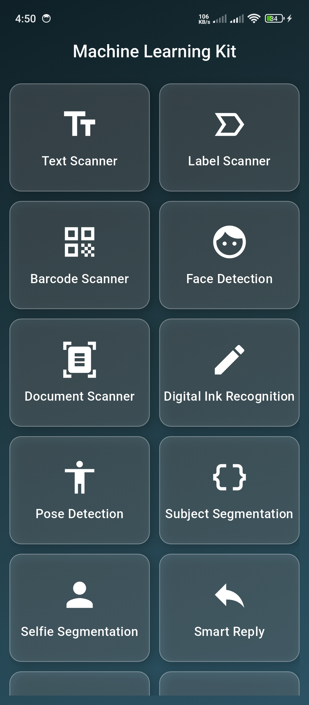
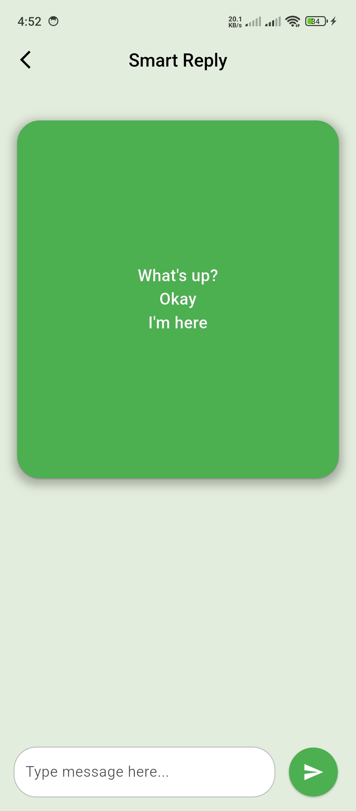
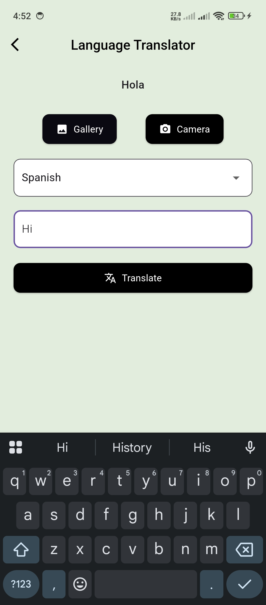
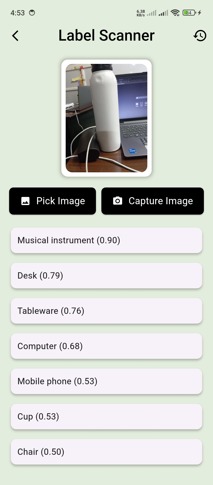

# ML Kit Test

## Screenshots

| Screenshot 1 | Screenshot 2 | Screenshot 3 | Screenshot 4 |
|-------------|-------------|-------------|-------------|
|  |  |  |  |

ML Kit Test is a Flutter application that utilizes Google's ML Kit for text recognition and scanning. This app allows users to capture text from images using their camera or gallery and store the scanned results in Firebase. Additionally, it provides a history feature to view past scans.
